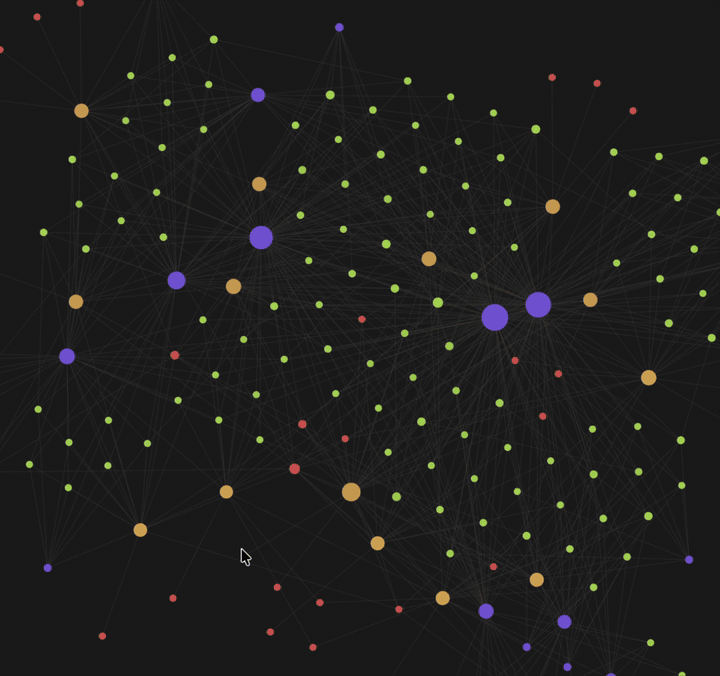
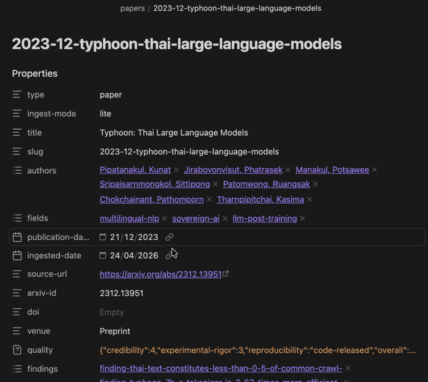

<p align="center">
  
</p>

<p align="center">
  <em>A Claude Code Plugin for Self-maintaining research knowledge graph for Claude Code + Obsidian.</em>
</p>

<p align="center">
  <a href="LICENSE.txt"></a>
  <a href="https://code.claude.com/docs/en/discover-plugins"></a>
  <a href="https://obsidian.md"></a>
</p>

<table align="center">
  <tr>
    <td align="center" width="50%">
      
    </td>
    <td align="center" width="50%">
      
    </td>
  </tr>
  <tr>
    <td align="center">
      <sub>
        Knowledge graph view — 🟡 papers · 🟢 findings · 🟣 fields · 🔴 authors. Example shown: <a href="https://opentyphoon.ai/blog/en">Typhoon.AI</a> research papers.
      </sub>
    </td>
    <td align="center">
      <sub>
        Per-paper info page — 4-section summary (incl. critique), atomic findings, metadata + quality scores, and typed edges to related work.
      </sub>
    </td>
  </tr>
</table>

**Keep every paper you care about. See how they connect.** Drop in a URL, arXiv ID, DOI, or PDF — Claude files it into an Obsidian vault, extracts the atomic claims, and wires them to everything you've read before with typed edges: `supports`, `contradicts`, `extends`, `uses`, `similar-to`.

Based on [Andrej Karpathy's LLM Wiki pattern](https://gist.github.com/karpathy/442a6bf555914893e9891c11519de94f), tuned for research papers. **4 LLM calls per paper. Zero manual filing. Linking cost stays constant as the graph grows.**

---

## Features

- **4-section triage summary per paper** — Key Takeaways → Background → Main Idea & Summary → **Critique**. The critique is generated by a reasoning model, so you get critical thinking, not a polite restatement of the abstract.
- **Structured metadata + quality scores** — authors, venue, date, fields, and a quality assessment (credibility, experimental rigor, reproducibility) on every paper.
- **Atomic findings as graph nodes** — one claim per file, with frontmatter and backlinks.
- **Typed edges** — `supports`, `contradicts`, `extends`, `uses`, `similar-to`; auto-aggregated to paper-level (`cites`, `builds-on`, …).
- **Deterministic citation matching** — arXiv ID → DOI → fuzzy title → first-author+year. The LLM never sees the reference list.
- **Constant-cost linking** — pre-filter caps the LLM at ≤30 candidate findings, so the 100th paper costs the same as the 10th.
- **Cross-paper contradiction surfacing** — bidirectional, with a pre-built Dataview view.
- **Pre-built Dataview views** — by-author, by-field, contradictions, high-credibility, recent-papers.
- **Obsidian-native** — plain wikilinks + YAML frontmatter, no custom app, no lock-in.

---

## Quick Start

```bash
# 1. Install the plugin
claude --plugin-dir /path/to/claude-paperloom

# 2. Scaffold your vault (default ~/PaperLoom)
#    On first run, this creates `.venv` at the plugin root and installs
#    dependencies from `requirements.txt` automatically.
/paperloom:init

# 3. Ingest your first paper
/paperloom:ingest https://arxiv.org/abs/1706.03762
```

Open the vault folder in Obsidian and turn off Restricted Mode once to activate Dataview.

---

## Commands

| You run | Claude does |
|---|---|
| `/paperloom:init [path]` | Scaffold the vault. Idempotent. Seeds Dataview. |
| `/paperloom:ingest <url\|arxiv-id\|doi\|pdf>` | Fetch, summarize, extract findings, link. Skips if already in vault. |
| `/paperloom:query <question>` | Search + synthesize across the vault with wikilink citations. |
| `/paperloom:lint` | Health check. Auto-wires near-duplicate findings with bidirectional `similar-to`. |

---

## Docs

- [Pipeline](docs/pipeline.md) — the 4-LLM-call ingest pipeline, section detection, models, token cost.
- [Linking](docs/linking.md) — five-layer linking, relation types, paper-level aggregation.
- [Architecture](docs/architecture.md) — vault layout, plugin structure, design principles, out-of-scope.
